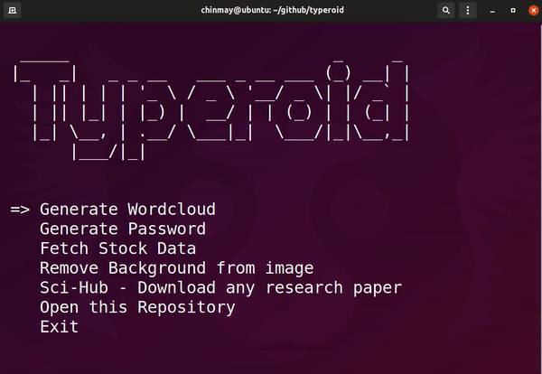
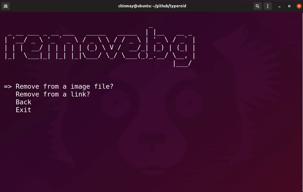
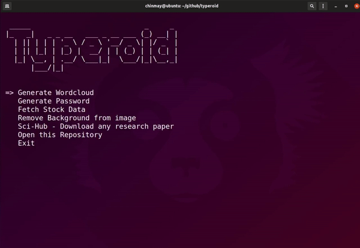
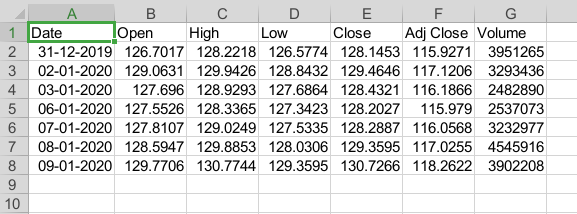
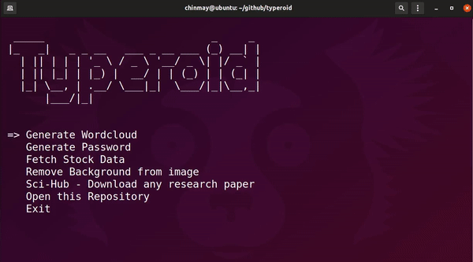
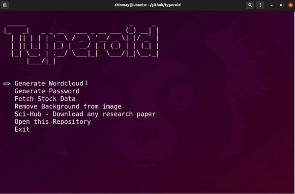
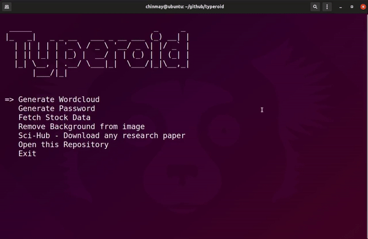

<p align="center">
  
</p>
<h1 align="center">Welcome to typeroid </h1>
<br>
<p>
  <a href="https://github.com/chinmay29hub/typeroid/blob/main/LICENSE" target="_blank">
    
  </a>
  <a href="https://twitter.com/chinmay29hub" target="_blank">
    
  </a>
</p>
<br>

> A simple command line utility using typer library in python.

<br>

### 🏠 [Homepage](https://github.com/chinmay29hub/typeroid)

<br>

## Install (Windows)

```sh
python3 -m pip install -r requirements.txt
```
## Install (Linux)

```sh
pip3 install -r requirements.txt
```
<br>

## remove.bg(api)

> In order to use the remove.bg feature you need to add config.py file in the root directory of typeroid folder and add the following line [Replace 'YOUR_API' with you own api key]

<br>

```
api_key = "YOUR_API"
```
<br>

## Usage
<br>

```sh
python3 app.py --help
```
<br>

### Either pass commands as arguements or use the menu : 

```
python3 app.py menu
```
#### Ouput : 
<br>
<p align='center'>

</p>
<br>

***
### The commands executed below are with the help of arguements you can use the menu to execute the commands.

***
<br>

### Remove.bg : 
<br>

```
python3 app.py removebg
```

<br>
<p align='center'>

</p>
<br>
<p align='center'>

</p>

***
<br>

### Download Stock Data :
<br>

```
python3 app.py stock 
```
<p align='center'>

</p>
<br>
<p align='center'>

</p>

***
<br>

### Generate wordcloud :
<br>

```
python3 app.py wordcloud
```
<p align='center'>

</p>

***
<br>

### Generate Password : 
<br>

```
python3 app.py password
```
<p align='center'>

</p>
<br>

### Download any Research paper (SCIHUB): 
<br>

>As you can see in the below image I can't download the pdf file because we require a IEEE account or a organization account to download the pdf file. But with scihub we can download it easily.

<br>

<p align=''center>

</p>
<br>

#### Command for scihub : 
<br>

```
python3 app.py scihub
```

<p align='center'>

</p>
<br>

#### You can view the sample pdf [here](pdf/machine_learning.pdf)

<br>

.....More commands coming soon

<br>

## Author

👤 **Chinmay Sonawane**

* Instagram: [@chinmay29hub](https://www.instagram.com/chinmay29hub/)
* Twitter: [@chinmay29hub](https://twitter.com/chinmay29hub)
* Github: [@chinmay29hub](https://github.com/chinmay29hub)
* LinkedIn: [@chinmay-sonawane-38474019a](https://linkedin.com/in/chinmay-sonawane-38474019a)

<br>

## 🤝 Contributing

Contributions, issues and feature requests are welcome!<br />Feel free to check [issues page](https://github.com/chinmay29hub/typeroid/issues).

<br>

## Show your support

Give a ⭐️ if this project helped you!

<br>

## 📝 License

Copyright © 2022 [Chinmay Sonawane](https://github.com/chinmay29hub).<br />
This project is [MIT](https://github.com/chinmay29hub/typeroid/blob/main/LICENSE) licensed.
<p align="center">
  
</p>
