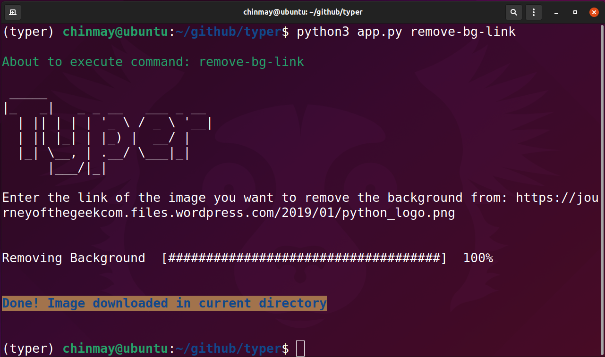
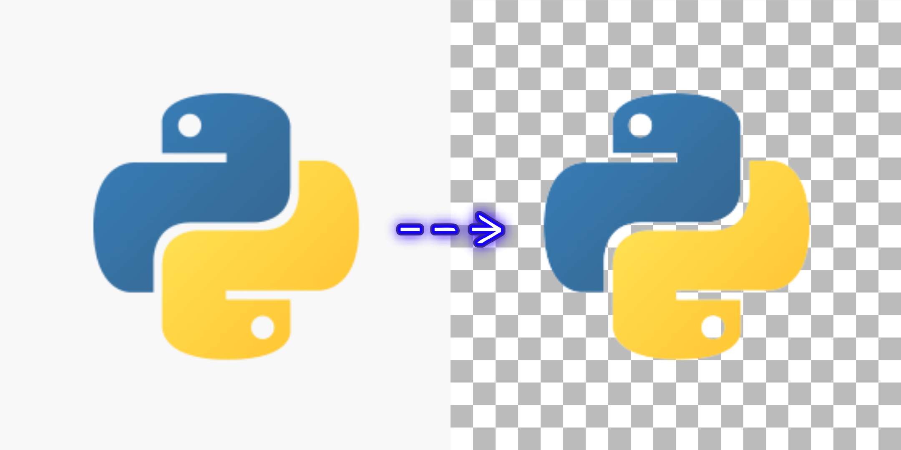
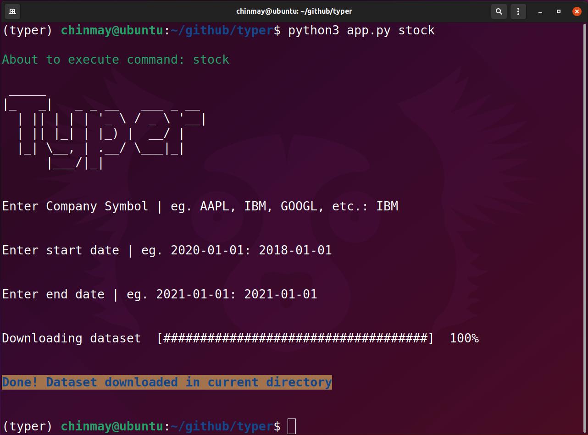
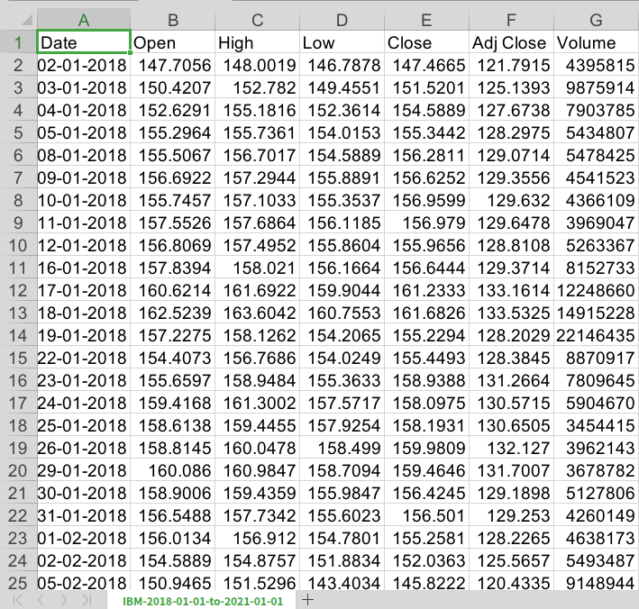
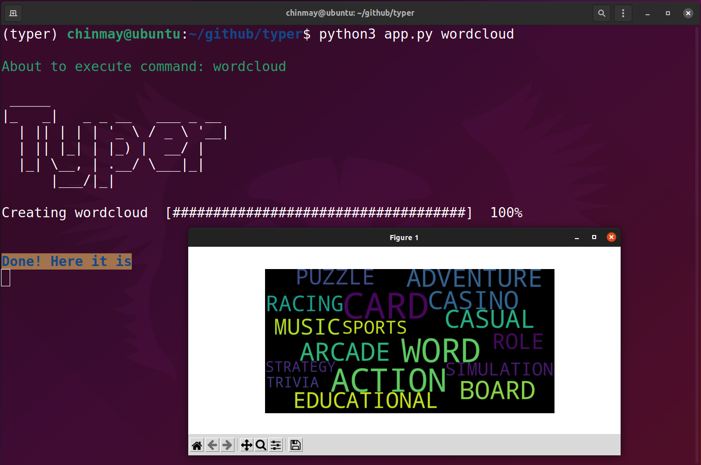
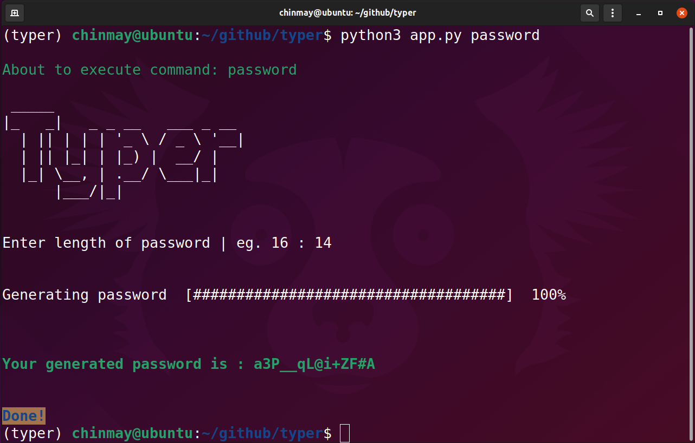

<p align="center">
  
</p>
<h1 align="center">Welcome to typeroid </h1>
<br>
<p>
  <a href="https://www.npmjs.com/package/typer" target="_blank">
    
  </a>
  <a href="https://github.com/chinmay29hub/typer/blob/main/LICENSE" target="_blank">
    
  </a>
  <a href="https://twitter.com/chinmay29hub" target="_blank">
    
  </a>
</p>
<br>

> A simple command line utility using typer library in python.

<br>

### 🏠 [Homepage](https://github.com/chinmay29hub/typer)

<br>

## Install (Windows)

```sh
python3 -m pip install -r requirements.txt
```
## Install (Linux)

```sh
pip3 install -r requirements.txt
```
<br>

## remove.bg(api)

> add config.py file in the root directory of typer and add the following line [Replace 'YOUR_API' with you own api key]

<br>

```
api_key = "YOUR_API"
```
<br>

## Usage
<br>

```sh
python3 app.py --help
```
***
<br>

```
python3 app.py remove-bg-link //remove backgroud from image link
```
```
python3 app.py remove-bg-file //remove backgroud from image file location
```
<p align='center'>

</p>
<br>
<p align='center'>

</p>

***
<br>

```
python3 app.py repository // open this repository
```
```
python3 app.py stock //get stock dataset
```
<p align='center'>

</p>
<br>
<p align='center'>

</p>

***
<br>

```
python3 app.py wordcloud //generate a wordcloud from dataset provided in dataset/android_games.csv
```
<p align='center'>

</p>

***
<br>

```
python3 app.py password //generate password
```
<p align='center'>

</p>
<br>

.....More commands coming soon

<br>

## Author

👤 **Chinmay Sonawane**

* Website: https://www.instagram.com/chinmay29hub/
* Twitter: [@chinmay29hub](https://twitter.com/chinmay29hub)
* Github: [@chinmay29hub](https://github.com/chinmay29hub)
* LinkedIn: [@chinmay-sonawane-38474019a](https://linkedin.com/in/chinmay-sonawane-38474019a)

<br>

## 🤝 Contributing

Contributions, issues and feature requests are welcome!<br />Feel free to check [issues page](https://github.com/chinmay29hub/typer/issues).

<br>

## Show your support

Give a ⭐️ if this project helped you!

<br>

## 📝 License

Copyright © 2022 [Chinmay Sonawane](https://github.com/chinmay29hub).<br />
This project is [MIT](https://github.com/chinmay29hub/typer/blob/main/LICENSE) licensed.
<p align="center">
  
</p>
